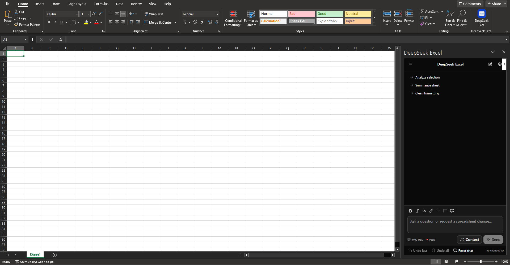

# DeepSeek Excell by dezuhan

A **DeepSeek sidebar inside Microsoft Excel 2021** that can read and modify the spreadsheet you have open —
similar to Gemini in Google Sheets, but powered by DeepSeek and running entirely on your own machine.

> **The name inside Excel stays “DeepSeek Excel”** — that is the add-in name, the ribbon button and the task pane
> title. **“DeepSeek Excell by dezuhan”** is the project/repository name.
>
> GitHub: **<https://github.com/dezuhan>**

Every change is shown first as a **plan card** (sheet, range, before → after, cell count) and is written to the
workbook only after you press **Apply**. Each applied change is journaled and can be undone from the pane.

---

## 1. Quick start (one command)

Extract the archive (or clone the project) and run **one** of these from the project root:

```powershell
# Single command
powershell -ExecutionPolicy Bypass -File install.ps1

# Equivalent npm shortcut
npm run install:app
```

Or just **double-click `install.cmd`**.

The installer performs the full setup in seven steps: Node check → `npm install` → `.env` (API key) →
Heroicons assets → React pane build → Excel add-in registration → optional autostart/server start.
Useful switches: `-ApiKey sk-…`, `-AutoStart`, `-StartServer`, `-SkipSideload`, `-SkipBuild`, `-NonInteractive`, `-Force`.

When it finishes: **close every Excel window, reopen Excel, then go to Home → “DeepSeek Excel” → “DeepSeek Excel”.**

---

## 2. Verified environment

These values were checked on the machine where this project was built and tested:

| Item | Status |
|---|---|
| Excel | Office Home & Student 2021, `EXCEL.EXE 16.0.16327.20264` (x64) |
| Add-in web engine | Microsoft Edge **WebView2 Runtime 152.0.4191.66** (installed) |
| Node.js | v24.19.0 — npm must be called as `npm.cmd` (`npm.ps1` is blocked by the machine `AllSigned` policy) |
| Add-in registration | `HKCU\SOFTWARE\Microsoft\Office\16.0\Wef\Developer` (no administrator rights required) |
| HTTPS certificate | CA “Developer CA for Microsoft Office Add-ins” in `CurrentUser\Root` |
| DeepSeek | Tool calling verified: all 24 tool schemas accepted, `finish_reason = tool_calls` |
| Languages | **EN-US (default)** with an **ID-ID** translation; language picker in the header and in Settings |
| Icons | Official **Heroicons v2.2.0** pack (MIT) → inline SVG registry + `resvg`-rasterized ribbon PNGs |
| UI pane | **React 19 + Vite 8 + Tailwind CSS v4 + [shadcn/ui](https://ui.shadcn.com)** components (Radix UI, `cn()`, cva), built into `dist/` and served at `/taskpane.html` |

The **VSTO/COM add-in route was deliberately rejected**: it needs Visual Studio + .NET (not installed here) and a
much heavier deployment story, while the Office.js + WebView2 path is available and sufficient.

---

## 3. Manual installation (what the installer does)

```powershell
cd C:\path\to\DeepSeek-Excell-by-dezuhan

# 1. Dependencies + .env (reads DEEPSEEK_API_KEY from DSH credentials when available)
powershell -ExecutionPolicy Bypass -File scripts\setup.ps1

# 2. Generate icon assets
npm run assets

# 3. Build the React + shadcn/ui task pane into dist/ (required before use)
npm run build:ui

# 4. Register the add-in in Excel (HKCU registry, no admin)
powershell -ExecutionPolicy Bypass -File scripts\sideload.ps1

# 5. Run the local server
npm start
```

Keep the server running while you use the sidebar. To start it automatically at every boot/logon (still no admin):

```powershell
powershell -ExecutionPolicy Bypass -File scripts\autostart.ps1           # install
powershell -ExecutionPolicy Bypass -File scripts\autostart.ps1 -Status   # check
powershell -ExecutionPolicy Bypass -File scripts\autostart.ps1 -Remove   # remove
```

`install.cmd` performs this step for you (`-AutoStart` is always passed; add `-NoAutoStart` to opt out).
The logon entry is a `.vbs` launcher in your Startup folder that runs `scripts\run-server.cmd` with
window style 0, so the server starts **hidden - no CMD window ever pops up at boot**. The real work is
done by `scripts\start-server.ps1`, which first checks the port: if a server is already listening, it
exits instead of starting a second copy.

> Do **not** put a shortcut to `install.cmd` in the Startup folder: that opens a visible CMD window and
> re-runs the whole installer on every logon. If an older setup did that, `scripts\autostart.ps1` removes
> that shortcut automatically and replaces it with the hidden `.vbs` launcher.

Full removal:

```powershell
powershell -ExecutionPolicy Bypass -File scripts\unsideload.ps1 -ClearCache
```

---

## 4. Using the sidebar

1. Open any workbook and click **Home → DeepSeek Excel**.
2. Ask for something, for example:
   - “Create a monthly expense tracker on a new sheet with columns Date, Description, Category, Income, Expense.”
   - “Analyze the data I selected and give me five insights, flag anything unusual.”
   - “Clean up A1:F30: bold header with a fill, thousands separator for numbers, autofit columns.”
   - “Build a bar chart from B2:C10 and place it at H2.”
   - “Find ‘Kebutuhan’ and replace it with ‘Pokok’ on this sheet.”
3. A **plan card** appears with a diff. Press **Apply** (or **Cancel**).
4. Made a mistake? Press **Undo last**, or **Undo all** to revert the whole session.

An empty chat shows only three one-line suggestions (Analyze selection, Summarize sheet, Clean
formatting); they disappear as soon as the conversation starts. There is no greeting block.
Clicking a suggestion **writes it into the composer** (appending to whatever is already there) so
you can edit it before pressing Send — nothing is sent behind your back.

The header keeps just three buttons: **chat history**, **new chat** and **settings**. Settings is a
**full page** with its own menu, not a floating dialog: **Model** (API key, fetch mode, default
model, reasoning effort, cells per write/read, apply-automatically toggle), **Interface**
(language, theme: System / Light / Dark), **Personalize** (base system prompt plus an addable list
of personalization entries, and the "this file only" note), **Cost** (balance, peak hours, prices,
this chat) and **About** (host, endpoint, GitHub). The theme choice is remembered between runs; in
System it follows the Windows/Office dark preference.

---

## 5. Language support

- The manifest uses `<DefaultLocale>en-US</DefaultLocale>` with `<Override Locale="id-ID">`, so Office shows the
  add-in name, description and tooltip in your Office language.
- The sidebar picks its language automatically: `?lang=` parameter → stored preference →
  `Office.context.displayLanguage` → browser language → **en-US** fallback. You can switch any time with the
  **EN/ID** picker in the header or in Settings.
- Every product string (UI, plan cards, error messages, server messages, the model system prompt) exists in both
  languages in `public/js/i18n.js` — a single source of truth that `server.js` also `require()`s.
- Tool descriptions in `shared/tools.json` are intentionally **English only**: they are part of the model API
  contract, not the user interface.
- All project documentation, code comments and installer/script output are **English**.

---

## 6. Tools available to the model

Read: `get_workbook_overview`, `read_range`, `get_tables`, `list_charts`, `list_named_ranges`.

Write: `write_range` (values/formulas), `write_table_rows`, `format_range`, `clear_range`, `autofit_columns`,
`insert_rows`, `delete_rows`, `insert_columns`, `delete_columns`, `add_worksheet`, `rename_worksheet`,
`delete_worksheet`, `sort_range`, `create_table`, `create_chart`, `apply_autofilter`, `conditional_format`,
`find_replace`, `select_range`.

The canonical definitions live in `shared/tools.json` (shared by the sidebar and the server allowlist).

---

## 7. UI stack: React + shadcn/ui

- **Stack**: React 19, Vite 8, Tailwind CSS v4, `radix-ui` (Dialog, Select, Tooltip, ScrollArea, Switch, Label,
  Separator, Slot), `class-variance-authority`, `clsx` + `tailwind-merge` (`cn()`), `tw-animate-css`, and the
  shadcn theme tokens (`--background`, `--primary`, `--destructive`, `--ring`, …) with class-based dark mode
  (`.dark`). The theme is **System / Light / Dark**, picked in Settings → Interface, stored in
  `localStorage` and applied by `ui/src/lib/theme.js`; *System* follows the Windows `prefers-color-scheme`.
- **Settings is a full page, not a dialog**: `SettingsPage.jsx` renders a menu (Model, Interface, Personalize,
  Cost, About) and one page per concern, so the narrow task pane never has to scroll a modal.
- **Components used**: Button, Card, Badge, Separator, ScrollArea, Dialog, Select, Tooltip, Input, Label, Textarea,
  Switch — real shadcn/ui recipes, owned by this project under `ui/src/components/ui/`.
- **The engine stays vanilla**: `public/js/{i18n,validate,journal,office-api,mock-api,office-bridge,deepseek-client,agent}.js`
  are loaded as plain `<script>` tags from the local server (no bundler) and accessed by React through `window.DSX`.
  This keeps every existing Node test valid and makes the Excel.js layer easy to test.
- **Rebuild after changing the UI**: `npm run build:ui` (or `npm run watch:ui` while developing).
- **Rollback pane**: `public/taskpane-classic.html` still contains the old vanilla pane. If the React pane ever
  misbehaves, point `SourceLocation` in `manifest.xml` at that URL, run `scripts\sideload.ps1`, and reopen Excel.
  It loads the very same Markdown engine from `/vendor/*`, so rendered answers look identical.

### Markdown engine (input and output)

The pane ships a real Markdown engine, used for **both** directions:

- **Output**: model answers, plan summaries and the user's own messages are rendered by
  **[marked](https://marked.js.org)** (GitHub-Flavored Markdown: tables, task lists, strikethrough, autolinks,
  fenced code) and then sanitized by **[DOMPurify](https://github.com/cure53/DOMPurify)** against a strict
  allowlist. Code blocks get a **Copy** button; headings, lists, quotes, tables and links are styled for the
  narrow task pane. Links are forced to `target="_blank" rel="noopener noreferrer"` so they open in the system
  browser, embedded images are reduced to their alt text, raw HTML is escaped, and only `http`, `https`, `mailto`,
  anchors and relative URLs survive — obfuscated `java\tscript:` payloads included.
- **Input**: the composer has a Markdown toolbar (Bold, Italic, Inline code, Link, Bullet list, Numbered list,
  Quote) that wraps the current selection and toggles line prefixes, and the draft is **previewed
  automatically** below the input — there is no eye/preview toggle any more. The preview renders through the
  same engine but with headings disabled: typing `#`, `##` or `###` keeps the markers literal, because headings
  in a chat message only add noise. Model **answers keep full heading support**. Keyboard shortcuts:
  **Ctrl+B** bold, **Ctrl+I** italic, **Ctrl+E** inline code, **Ctrl+K** link, **Enter** send,
  **Shift+Enter** newline.
- **Classic pane**: `server.js` serves `marked.umd.js` and `purify.min.js` from `node_modules` at
  `/vendor/marked.js` and `/vendor/dompurify.js`, so the fallback pane renders Markdown with the same libraries
  and supports the same Ctrl+B/I/E/K shortcuts — no duplicated copy to keep in sync.

---

## 8. Architecture

```
Excel 2021 (WebView2)                      Local Node :3000                 api.deepseek.com
┌──────────────────────────┐   HTTPS      ┌────────────────────────┐  HTTPS  ┌───────────────┐
│ dist/ (React + shadcn)   │ ───────────► │ server.js              │ ──────► │ /chat/…       │
│  ui → agent → bridge     │  /api/chat   │  • static + pane token │         │ (SSE stream)  │
│  office-api → Office.js  │ ◄─────────── │  • tool allowlist      │ ◄────── │               │
└──────────────────────────┘   SSE        │  • body/message caps   │         └───────────────┘
        │ Excel.run                        │  • writes .env         │
        ▼                                  └────────────────────────┘
   Active workbook                                  ▲
                                                    │ never sent to the pane
                                              DEEPSEEK_API_KEY (.env)
```

- **The sidebar owns the agent loop**: it calls the model, receives `tool_calls`, executes them through Office.js,
  and feeds the results back to the model.
- **The server is only a proxy**: it injects the API key, validates tool names, enforces size limits, and serves assets.
- **Pane token**: regenerated on every server start and served through `/pane-token.js`; any `/api/*` request without
  it is rejected with 401, so other local processes cannot piggyback on your API key.

---

## 9. Sessions, personalization, effort and the cost meter

### Chat sessions (CouchDB-style store)

Chats are saved on the local server as CouchDB-shaped documents (`_id`, `_rev`, `_deleted`
tombstones, `allDocs` listing, optimistic-concurrency conflicts) inside `store/`:

- **New chat** (pencil icon) starts a fresh session; the first turn is stored together with the
  messages and usage it was created with, so a brand-new chat never shows up as empty.
- **Chats** (menu icon) opens a history drawer grouped like Gemini's Recents — **Today**,
  **Yesterday**, **Previous 7 days**, **Older** — with one compact row per chat (relative time and
  turn count; the delete button appears on hover). Selecting a row restores its messages, model and
  effort; deleting one writes a tombstone.
- Each saved session carries the token usage of every request, already costed at the peak or
  off-peak rate that applied when the request happened.

```
GET|POST      /api/sessions          list (id, title, turnCount, messageCount, totals) / create
GET|PUT|DEL   /api/sessions/:id      read / update (409 on stale _rev) / tombstone
```

### Personalization: an addable list, global and per-file

- **Global** (stored on the server, applies to every workbook including new files) lives in the
  `personalization:global:<host>` document as a **list of entries** (`{id, title, text}`) and is
  edited under Settings → Personalize. Start from the base system prompt, then add as many entries
  as you need (writing style, currency, forbidden ranges…); each entry is composed into the system
  prompt under its title.
- **Presets** fill that list with a ready-made style in one click — **Professional** (business tone,
  tables for comparisons, explicit assumptions) and **To the point** (answer first, at most three
  bullets, no filler), plus **Default** to remove the preset again. A preset is a single replaceable
  entry (`preset:professional`, `preset:compact`), so switching never stacks styles, it stays
  editable afterwards, and the whole list is saved immediately.
- **This file only** travels *inside* the workbook through Office document settings, so it never
  leaks into other files. The pane also mints a stable `file:` id for the document.
- Both layers are appended to the system prompt as separate system messages (global first, then
  the file one), so the model always knows which instruction wins.
- `PUT /api/personalization` accepts either `{entries: [...]}` or the plain `{text}` shortcut;
  `GET` always returns both the entry list and the composed `text`.

### Fetch mode: live or mock

Settings → Model switches the server between the **live DeepSeek API** and **mock** answers at
runtime (`POST /api/config {mock: true|false}`), which is handy for demos, screenshots and for
trying the UI without spending credit. Mock mode never calls DeepSeek and is announced in the
banner.

### Reasoning effort

Settings → Model offers **Off / Low / High / Max**, mapped to DeepSeek's documented parameters:

| Effort | Request payload |
|---|---|
| Off | `thinking: {type: "disabled"}` |
| Low / High / Max | `thinking: {type: "enabled"}` + `reasoning_effort: "low" / "high" / "max"` |

Because requests include `tools`, the pane echoes `reasoning_content` back on every later turn —
the DeepSeek API rejects multi-turn tool conversations that drop it. The visible chain of thought
is shown in a collapsible block and can be disabled with effort **Off**.

### Cost meter

The composer footer carries a **compact cost badge** — `⛁ 12.34 USD · Off-peak` — instead of the old
Markdown hint: balance first, then a coloured dot and the current peak state, separated by a middle dot
(`·`). It is loaded at boot, refreshed after every request, and clicking it opens Settings → Cost.

Settings → Cost shows the live picture:

- **Balance** straight from `GET /user/balance`, per currency (the API key used here reports CNY).
- **Peak status**: peak hours are **01:00–04:00 and 06:00–10:00 UTC, Monday–Friday**; off-peak is
  half price. The meter shows the current state and counts down to the next change.
- **Latest prices** per model (input cache-hit, input cache-miss, output, per 1M tokens) for the
  current peak state, read from `shared/pricing.json` and merged with any stored
  `pricing:override` document (`PUT /api/pricing` lets you update rates without touching files).
- **This chat**: requests, tokens and the accumulated cost, computed from the `usage` payload that
  the proxy requests with `stream_options.include_usage` and costed server-side at the rate that
  applied to each request.

---

## 10. Limitations

- **Excel's own Ctrl+Z does not undo programmatic changes.** Use the pane's **Undo** buttons.
- Undo is **exact for data** (values, formulas, number formats, cell formatting). For structural operations
  (row/column/sheet deletion) undo is **best effort**: contents come back from a snapshot, but charts, tables and
  conditional formats that were deleted with the sheet are not restored. The plan card states this.
- Ranges larger than ≈20,000 cells are not snapshotted, so undo is unavailable and the UI says so.
- Default limits: **5,000 cells per write**, **2,000 cells per read**, **12 tool steps per turn**.
- Formulas must be written with `mode="formulas"` in en-US syntax with comma separators (`=SUM(B2:B10)`); this keeps
  the add-in correct even when Excel runs with the Indonesian locale.
- The sidebar only works on the active workbook; it never creates, opens or saves files.
- Windows only (registration uses HKCU). Excel on the web and Mac are not supported.

---

## 11. Packaging and distribution

```powershell
npm run package
# or
powershell -ExecutionPolicy Bypass -File scripts\package.ps1
```

Produces, in `release/`:

- `DeepSeek-Excell-by-dezuhan-v1.0.0.zip` — the project inside one top-level folder
- `DeepSeek-Excell-by-dezuhan-v1.0.0.zip.sha256` — SHA-256 checksum

The archive **excludes** `node_modules/`, `.env` (it holds your private API key), `logs/`, caches, `.git/`, and any
previous archives — and the script verifies this before finishing. `.env.example` **is** included so the recipient
knows which variables are needed. `dist/` is included so the pane works immediately after `npm install`, and
`install.ps1` rebuilds it anyway.

Recipient instructions (also printed by the script):

1. Extract the archive anywhere.
2. Run `powershell -ExecutionPolicy Bypass -File install.ps1` (or double-click `install.cmd`).
3. Close every Excel window, reopen Excel, and use Home → “DeepSeek Excel”.

---

## 12. Development and testing

```powershell
npm test                 # 150 tests: official Microsoft manifest validation, React+shadcn smoke test in jsdom,
                         # bilingual i18n contract, Heroicons assets, address validation, SSE assembler,
                         # journal/undo, bridge + mock API, UI and server contracts
npm run build:ui         # build the React task pane into dist/ (required after changing ui/src)
npm run watch:ui         # rebuild automatically while editing ui/src
npm run dev:ui           # Vite dev server with a proxy to the local server (open in Edge/Chrome, not Excel)
npm run assets           # regenerate the Heroicons barrel + ribbon PNGs from the official pack
npm run start:mock       # server with a mock LLM (no DeepSeek calls, no cost)
```

Test the UI without Excel: run `npm run start:mock` and open
`https://localhost:3000/taskpane.html?mock=1` — the React pane uses an in-memory spreadsheet.

Test the UI without a browser: `test/ui-react.test.js` builds the real bundle with esbuild, runs it in jsdom and
exercises boot → render → plan card → **Apply**, so UI runtime errors are caught before Excel ever sees them.
The suite never touches your working files: `DSX_STORE_DIR` points the document store at a temporary folder and
`DSX_ENV_FILE` does the same for `.env`, so `POST /api/config` from a test can never flip your real server into
mock mode or change your saved model.

Debugging inside Excel:

```powershell
powershell -ExecutionPolicy Bypass -File scripts\devtools.ps1 -RuntimeLogging
```

---

## 13. Troubleshooting

| Symptom | Cause and fix |
|---|---|
| The DeepSeek button is missing | Excel was not restarted after registration. Close **all** Excel windows and reopen. Still missing: run `scripts\sideload.ps1 -Minimal` (the pane opens automatically), then clear `%LOCALAPPDATA%\Microsoft\Office\16.0\Wef\` |
| Task pane is blank | The React pane has not been built: run `npm run build:ui` and reload the pane. `/taskpane.html` also shows a diagnostic page reminding you. Quick rollback: point `SourceLocation` in `manifest.xml` at `https://localhost:3000/taskpane-classic.html`, run `scripts\sideload.ps1`, reopen Excel |
| “Local server unreachable” | The server is not running. Start it with `npm start`, or install `scripts\autostart.ps1` |
| “No DeepSeek API key yet” | Run `scripts\setup.ps1` (reads DSH credentials) or paste the key in the Settings dialog |
| HTTPS certificate error | The development CA is not trusted: delete `C:\Users\<you>\.office-addin-dev-certs` and run `npm start` again (it regenerates and installs into CurrentUser) |
| `npm : … cannot be loaded` | The `AllSigned` policy blocks `npm.ps1`. Use `npm.cmd` (all scripts in this repo already do) |
| The pane shows a WebView2 warning | WebView2 Runtime is missing. Install the *Evergreen Standalone Installer*, then run `scripts\sideload.ps1 -ForceWebView2` |
| The model refuses to edit | Check whether the sheet is protected (Review → Unprotect Sheet); the sidebar reports this explicitly |
| `EALLOWSCRIPTS` when running the shadcn CLI | npm 11.17 rejects the CLI's `--allow-scripts` flag. The shadcn components are already committed under `ui/src/components/ui/`, so the CLI is not needed |

---

## 14. Project structure

```
DeepSeek-Excell-by-dezuhan/
├─ install.ps1 / install.cmd   # one-command installer; the wrapper always installs the hidden autostart
├─ manifest.xml                # add-in + ribbon button Home → DeepSeek Excel
├─ manifest-minimal.xml        # fallback without the ribbon
├─ server.js                   # HTTPS + static + /api/chat (SSE) + pane token
├─ store.js                    # CouchDB-style JSON document store (_id/_rev/_deleted/allDocs)
├─ api-store.js                # /api/sessions, /api/personalization, /api/prompts, /api/cost, /api/pricing
├─ pricing.js                  # peak-hour windows, price merge, per-request cost estimation
├─ store/                      # runtime documents: sessions, prompts, personalization, pricing override
├─ shared/tools.json           # 24 tool definitions (English, part of the model API)
├─ shared/pricing.json         # DeepSeek rates + peak windows + effort levels (mirrors the docs)
├─ ui/                         # React + shadcn/ui task pane (built by Vite)
│  ├─ index.html               # loads the vanilla engine from the server + the React bundle
│  └─ src/
│     ├─ App.jsx               # layout: header, status, chat, quick actions, composer, footer
│     ├─ components/ui/*.jsx   # shadcn/ui components (button, card, dialog, select, tooltip, …)
│     ├─ components/*.jsx      # Header, Banner, Chat, PlanCard, Composer, QuickActions,
│     │                        # SettingsPage, HistoryDrawer, Markdown
│     ├─ lib/{pane,store,icons,theme,markdown,utils}.js(x)   # markdown.js = marked + DOMPurify engine
│     │                        # theme.js = System/Light/Dark + localStorage
│     └─ index.css             # Tailwind v4 + shadcn theme tokens (light/dark)
├─ dist/                       # output of `npm run build:ui` (served at /ui/*)
├─ components.json             # shadcn/ui configuration (style new-york-v4)
├─ vite.config.mjs             # Vite + React + Tailwind v4 (assetsDir: ui)
├─ public/taskpane-classic.html|css  # classic vanilla pane (rollback, no build required)
├─ public/assets/              # rasterized ribbon icons + Heroicons MIT attribution
├─ public/js/                  # vanilla engine: i18n, validate, journal, office-api, mock-api,
│                              #                office-bridge, deepseek-client, agent, heroicons
├─ scripts/
│  ├─ setup.ps1                # dependencies + .env (key from DSH credentials)
│  ├─ dsh-key.ps1              # credential reader (used by setup and tests)
│  ├─ sideload.ps1             # register the add-in via the HKCU registry
│  ├─ unsideload.ps1           # remove add-in + autostart + cache
│  ├─ autostart.ps1            # hidden autostart at boot/logon + CMD-popup shortcut cleanup
│  ├─ start-server.ps1         # starts the server hidden (port-guarded, used by the autostart)
│  ├─ devtools.ps1             # DevTools / runtime logging for the add-in
│  ├─ build-assets.js          # Heroicons → React barrel + ribbon PNGs
│  └─ package.ps1              # distributable ZIP + SHA-256 (excludes node_modules/.env)
└─ test/                       # 150 automated tests (node --test)
```

---

## 15. Security

- The API key lives only in `.env` (ACL restricted to your user) and is used by the server. The sidebar never sees it.
- Every `/api/*` request must carry the pane token, which is regenerated on each server start.
- Cell contents are treated as **untrusted data**: tool results reach the model inside `<sheet_data>` blocks and the
  system prompt forbids following instructions found inside cells.
- There are no file operations: the add-in only touches the active workbook, and only after you approve each change.
- The distributable archive deliberately excludes `.env`, so your key cannot leak through a shared ZIP.

---

## 16. Attribution

Icons come from **[Heroicons](https://heroicons.com) v2.2.0** (Tailwind Labs), **MIT** licensed. A copy of the
license is in `public/assets/heroicons/LICENSE`, a summary in `NOTICE.md`, and every generated file names its source.
The ribbon icons (`icon-16/32/80.png`) are rasterizations of `24/solid/table-cells.svg` on a blue tile, because the
Office Add-in manifest only accepts raster files for ribbon buttons.

The interface uses **[shadcn/ui](https://ui.shadcn.com)** (MIT) on top of
**[Radix UI](https://www.radix-ui.com)** (MIT) and **[Tailwind CSS](https://tailwindcss.com) v4** (MIT).
Component files live in `ui/src/components/ui/` and are free to modify — in shadcn fashion, the component code
belongs to this project.

The Markdown engine uses **[marked](https://marked.js.org)** (MIT) and
**[DOMPurify](https://github.com/cure53/DOMPurify)** (Apache-2.0 OR MPL-2.0) for sanitization.


